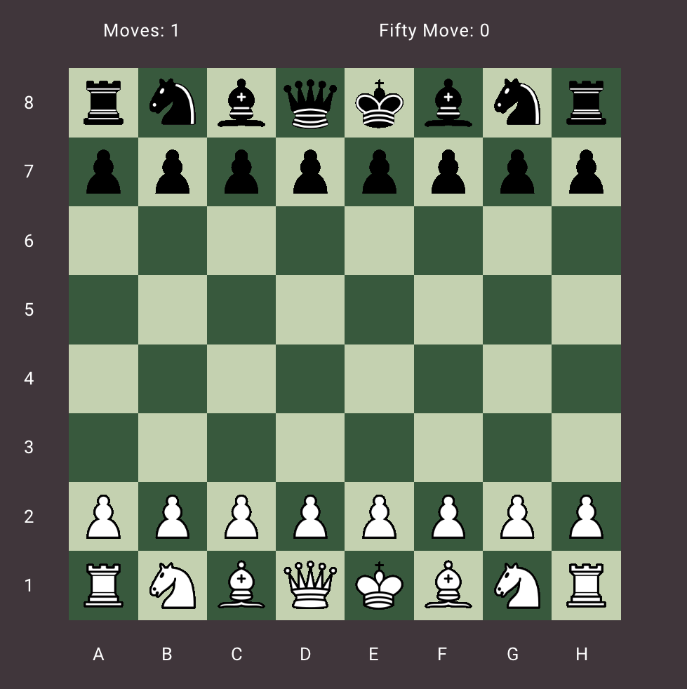
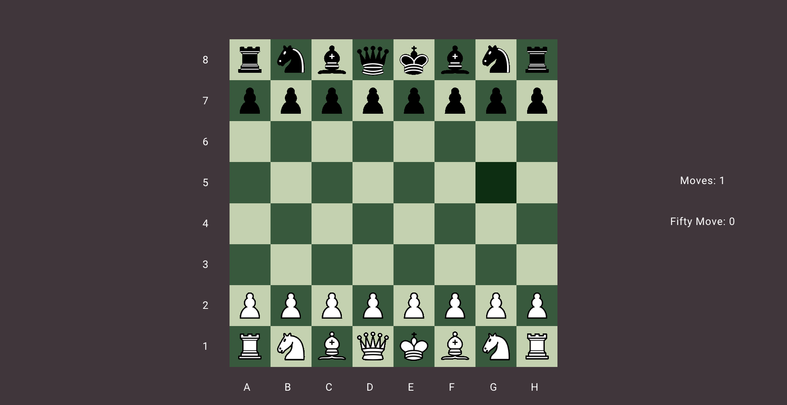
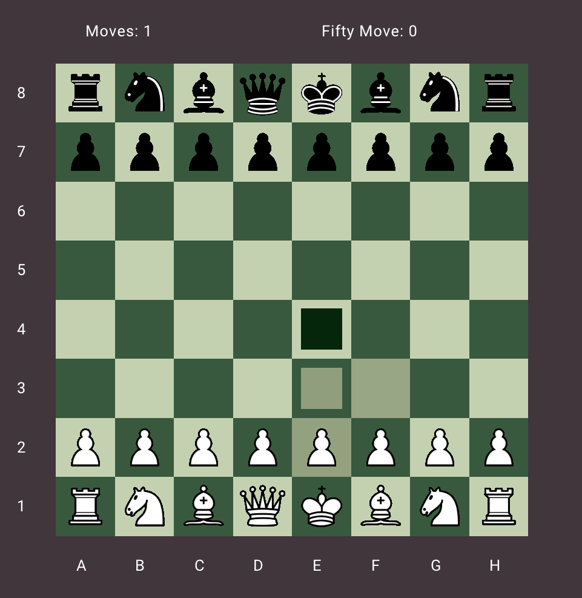
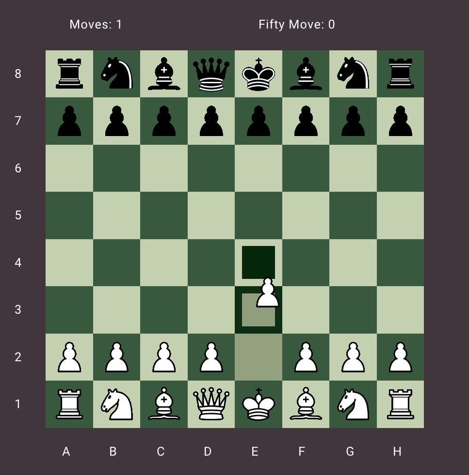
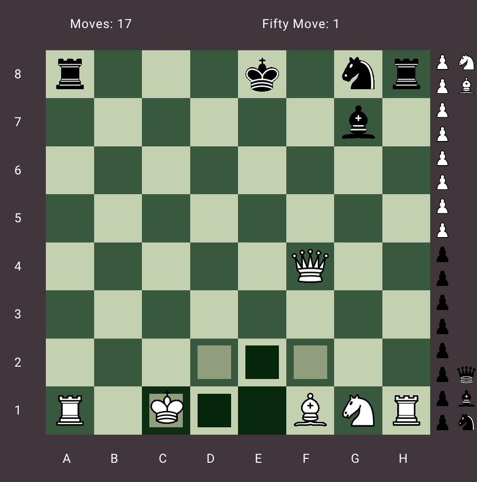

# Chess

## Build
----
### Windows
 download [premake5](https://premake.github.io/) binaries for windows and place it in the root folder and run
```
premake5.exe vs2022
```

### Others
 Not tested


 ## Screenshots

 
 
 
 
 